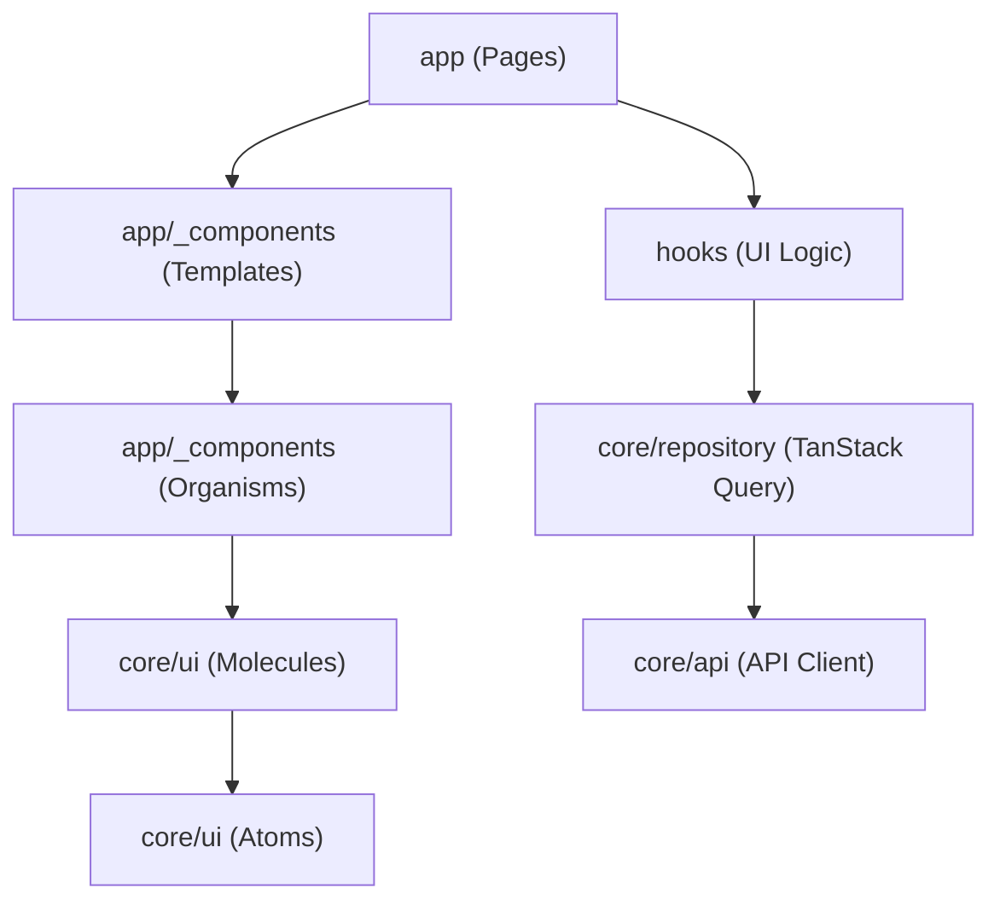

# 漁港のせり (Fish Auction)

漁港のせりシステムの実装プロジェクトです。

## 技術構成 (Tech Stack)

- **Frontend**: Next.js (React)
- **Backend**: Go
- **Database**: PostgreSQL
- **Web Server**: Nginx (Reverse Proxy)
- **Infrastructure**: Docker Compose

## アーキテクチャ (Architecture)

本プロジェクトは、保守性と拡張性を高めるために、関心の分離を意識したディレクトリ構成を採用しています。

### Backend (Go)
クリーンアーキテクチャの考え方を取り入れ、以下の3層構造で実装されています。


- **handler**: HTTPリクエストのパース、バリデーション、レスポンスの返却。
- **usecase**: 主要なビジネスロジック。
- **repository**: データベースなど、外部ストレージへのデータアクセス。

### Frontend (Next.js)
UI、状態管理、データ取得の役割を明確に分けています。UIに関しては **Atomic Design** を採用し、粒度に応じたディレクトリ配置を行っています。



- **app (Pages / Templates / Organisms)**: 
  - `app/_components/templates`: ページ全体のレイアウト構造（ヘッダー、サイドバーの配置など）。
  - `app/_components/organisms`: ヘッダーやナビゲーションなど、ドメイン知識を伴う具体的な機能の集合体。
- **hooks**: 画面固有のロジックやデータ取得を隠蔽するカスタムフック。
- **core/ui (Atoms / Molecules)**: ドメインに依存しない、再利用可能な汎用UIコンポーネント群。
- **core/repository**: TanStack Query によるサーバー状態の管理。
- **core/api**: API 通信を行うためのクライアント定義。

## 開発環境のセットアップ (Setup)

### Requirements

- Docker
- Docker Compose

### Setup

#### 1. HTTPS Certificates (mkcert)

開発環境ではHTTPSを使用します。`mkcert` を使用して証明書を作成してください。

```bash
# Install local CA (First time only)
mkcert -install

# Generate certificates
mkdir -p nginx/certs
mkcert -key-file nginx/certs/key.pem -cert-file nginx/certs/cert.pem localhost 127.0.0.1
```

#### 2. Build and Run

以下のコマンドを実行して、アプリケーションをビルド・起動します。

```bash
docker-compose up -d --build
```

### Access

起動後、以下のURLで各サービスにアクセスできます。

- **Frontend**: [http://localhost](http://localhost)
- **Backend API**: [http://localhost/api/](http://localhost/api/)
  - Health Check: [http://localhost/api/health](http://localhost/api/health)

## Directory Structure

- `frontend/`: Next.js アプリケーション
- `backend/`: Go API サーバー
- `nginx/`: Nginx 設定
- `docker-compose.yml`: コンテナ構成定義
- `AGENTS.md`: AI エージェント用ガイドライン

## Development Rules

開発の進め方やAIエージェントの利用については [AGENTS.md](./AGENTS.md) を参照してください。
