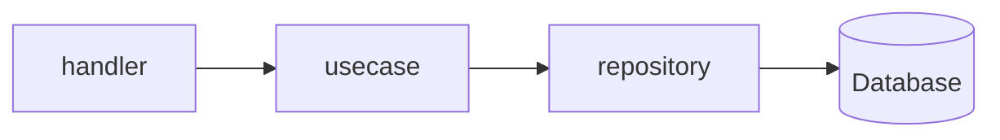
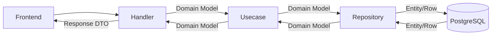
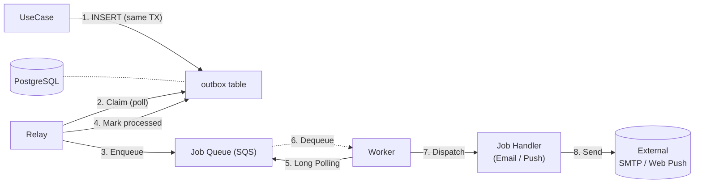

# Backend (Go)

漁港のせりシステムのバックエンドAPIサーバーです。

## 技術構成 (Tech Stack)

- **Language**: Go 1.26+
- **Database**: PostgreSQL
- **Cache**: Redis
- **Framework/Libraries**:
  - `net/http` (`http.ServeMux`)
  - [Air](https://github.com/cosmtrek/air) (Live Reload)
  - `database/sql` (Standard Library for DB access)
  - `lib/pq` (PostgreSQL Driver)
  - Background Processing (Worker for async jobs like Push Notifications)
  - golang-migrate (`cmd/migration` で実行する独立マイグレーションコマンド)

## アーキテクチャ (Architecture)

保守性と拡張性を高めるために、関心の分離を意識した **クリーンアーキテクチャ** を採用しています。



### データフロー (Data Flow)

ドメインモデル（`internal/domain`）をアプリケーションの中心に据え、外部との境界で適切に変換を行うことで、ビジネスロジックの純粋性を保っています。



### 非同期処理 (Outbox + Relay + Worker)

API サーバーの処理負荷を下げ、リアルタイム性を維持するために、時間のかかる処理や非同期で実行可能なタスクを分離して実行します。
ビジネス処理（DB 更新）とジョブ送信を **Transactional Outbox パターン** で原子的に扱い、SQS へのリレーは独立プロセスが担います。

#### 処理のフロー

UseCase は同一 DB トランザクション内で Outbox テーブルにジョブを書き込みます。その後 Relay プロセスがそれを読み出して SQS に転送し、Worker がメッセージを処理します。



##### コンポーネント

- **Outbox**: PostgreSQL のテーブル。ジョブのペイロード・状態 (`pending` / `processing` / `processed` / `failed`) を保持。UseCase の DB トランザクションに含めることで「ビジネス処理が成功したのにジョブが投入されていない」という不整合を防ぎます。
- **Relay** (`cmd/relay`, `internal/relay`): Outbox を一定間隔でポーリングし、3 フェーズ方式で SQS に転送します。
  - **Phase 1 (TX)**: pending メッセージを `processing` に更新し、`claimed_by` カラムにインスタンス ID を書き込んで排他制御を取得。
  - **Phase 2 (no TX)**: SQS に Enqueue。外部 I/O 中は DB ロックを保持しません。
  - **Phase 3 (TX)**: 成功時は `processed` に更新。失敗時は `attempts` が `max_attempts` 未満なら `pending` に戻し `available_at` をバックオフで後ろ倒し、超過したら `failed` で打ち切り。
- **OutboxCleaner** (`internal/relay`): 別 goroutine で 2 つのループを動かします。
  - 古い `processed` レコードを retention 経過後に削除。
  - `processing` のままタイムアウトしたメッセージを `pending` に戻し、stuck 状態から復旧（`stale recovery`）。
- **Job Queue** (SQS / LocalStack): メッセージ永続化・再配信・DLQ を担当。Worker は Long Polling で取得します。
- **Worker** (`cmd/worker`, `internal/worker`): SQS からメッセージを受け取り、`JobType` に応じて handler にルーティングします。
- **Job Handler** (`internal/worker/handler`): プッシュ通知 / メール送信などの実装。失敗時はメッセージを削除せず、SQS の Visibility Timeout・DLQ で再試行制御を行います。

##### プロセス分離

Outbox / Relay / Worker を分離した結果、各プロセスは独立にスケール・再起動できます。

| プロセス | 責務 | DB | Redis | SQS |
|---|---|:-:|:-:|:-:|
| `cmd/server` | API ハンドリング・UseCase 実行・Outbox INSERT | ✅ | ✅ | – |
| `cmd/relay` | Outbox → SQS のリレーと cleanup | ✅ | – | ✅ |
| `cmd/worker` | SQS のメッセージを処理 | ✅ | – | ✅ |
| `cmd/migration` | DB スキーマ適用（ワンショット） | ✅ | – | – |

### レイヤー構造とディレクトリ

```text
backend/
├── cmd/                # エントリポイント
│   ├── server/         # API サーバー
│   ├── worker/         # 非同期ジョブワーカー
│   ├── relay/          # Outbox → SQS リレー / cleaner
│   ├── migration/      # DB マイグレーション CLI
│   ├── seed/           # 開発用シード
│   └── init_admin/     # 初期管理者作成
├── internal/
│   ├── domain/         # ドメイン層 (Entities, Interfaces)
│   ├── usecase/        # ユースケース層 (Business Logic)
│   ├── server/         # プレゼンテーション層 (Handlers, Routing)
│   ├── infrastructure/ # インフラ層 (Persistence, External Services)
│   ├── worker/         # ワーカー基盤 (Polling, Dispatching, Handlers)
│   ├── relay/          # Outbox Relay & Cleaner
│   └── migration/      # マイグレーション実行ロジック
└── migrations/         # DB マイグレーション SQL (go:embed)
```

## 開発環境 (Development)

バックエンドのみを個別に操作する場合の主なコマンドです。

### 前提条件

- **Go** (v1.26+)
- **PostgreSQL**, **Redis** が起動していること
  - ※ データベース等のインフラのみを Docker で起動する場合は `docker-compose up db redis` を実行してください。

### 1. データベースマイグレーション

サーバー / ワーカー / リレー はマイグレーションを実行しないため、起動前に必ず適用してください。

```bash
cd backend
make migrate          # = go run ./cmd/migration/main.go up
```

マイグレーションファイルは `migrations/` ディレクトリにあり、`go:embed` でバイナリに含まれます。
docker-compose 環境では `migration` サービスが起動時に自動で実行され、`server` / `worker` / `relay` は `service_completed_successfully` で待機します。

### 2. サーバーの起動 (with Air)

```bash
cd backend
air
```

### 3. ワーカーの起動

SQS のメッセージを処理するために、サーバーとは別にワーカーを起動する必要があります。

```bash
cd backend
go run ./cmd/worker/main.go
```

### 4. リレーの起動

Outbox テーブルから SQS へジョブを転送するために、リレーを起動する必要があります（Outbox Cleaner も同プロセスで動きます）。

```bash
cd backend
go run ./cmd/relay/main.go
```

> docker-compose 利用時は `worker` / `relay` サービスとして自動的に起動するため、個別実行は不要です。
