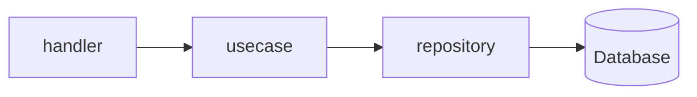
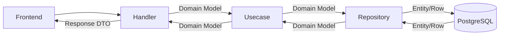
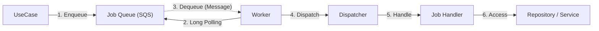

# Backend (Go)

漁港のせりシステムのバックエンドAPIサーバーです。

## 技術構成 (Tech Stack)

- **Language**: Go 1.26+
- **Database**: PostgreSQL
- **Cache**: Redis
- **Framework/Libraries**:
  - `net/http` (`http.ServeMux`)
  - [Air](https://github.com/cosmtrek/air) (Live Reload)
  - `database/sql` (Standard Library for DB access)
  - `lib/pq` (PostgreSQL Driver)
  - Background Processing (Worker for async jobs like Push Notifications)
  - golang-migrate (`cmd/migration` で実行する独立マイグレーションコマンド)

## アーキテクチャ (Architecture)

保守性と拡張性を高めるために、関心の分離を意識した **クリーンアーキテクチャ** を採用しています。



### データフロー (Data Flow)

ドメインモデル（`internal/domain`）をアプリケーションの中心に据え、外部との境界で適切に変換を行うことで、ビジネスロジックの純粋性を保っています。



### ワーカー

API サーバーの処理負荷を下げ、リアルタイム性を維持するために、時間のかかる処理や非同期で実行可能なタスクを分離して実行します。

#### 処理のフロー

UseCase からジョブがキューに投入され、Worker プロセスがそれを順次処理します。



- **Job Queue**: ジョブの永続化と再試行制御を担当します（開発環境では LocalStack による SQS 互換 API を使用）。
- **Worker**: ポーリングによってキューからメッセージを取得し、ライフサイクル（Graceful Shutdown 等）を管理します。
- **Dispatcher**: ジョブの種類（`JobType`）に応じて、適切なハンドラーへルーティングします。
- **Job Handler**: 具体的なビジネスロジック（例：プッシュ通知の送信、メール送信など）を実行します。

### レイヤー構造とディレクトリ

```text
backend/
├── cmd/                # エントリポイント
│   ├── server/         # API サーバーの起動設定
│   ├── worker/         # バックグラウンドワーカーの起動設定
│   ├── relay/          # Outbox リレー
│   └── migration/      # DB マイグレーション CLI
├── internal/
│   ├── domain/         # ドメイン層 (Entities, Interfaces)
│   ├── usecase/        # ユースケース層 (Business Logic)
│   ├── server/         # プレゼンテーション層 (Handlers, Routing)
│   ├── infrastructure/ # インフラ層 (Persistence, External)
│   ├── worker/         # ワーカー基盤 (Polling, Dispatching)
│   └── job/            # ジョブハンドラーの実装
└── migrations/         # DB マイグレーション
```

## 開発環境 (Development)

バックエンドのみを個別に操作する場合の主なコマンドです。

### 前提条件

- **Go** (v1.26+)
- **PostgreSQL**, **Redis** が起動していること
  - ※ データベース等のインフラのみを Docker で起動する場合は `docker-compose up db redis` を実行してください。

### 1. データベースマイグレーション

サーバー / ワーカー / リレー はマイグレーションを実行しないため、起動前に必ず適用してください。

```bash
cd backend
make migrate          # = go run ./cmd/migration/main.go up
```

マイグレーションファイルは `migrations/` ディレクトリにあり、`go:embed` でバイナリに含まれます。
docker-compose 環境では `migration` サービスが起動時に自動で実行され、`server` / `worker` / `relay` は `service_completed_successfully` で待機します。

### 2. サーバーの起動 (with Air)

```bash
cd backend
air
```

### 3. ワーカーの起動

非同期ジョブを処理するために、サーバーとは別にワーカーを起動する必要があります。

```bash
cd backend
go run ./cmd/worker/main.go
```
