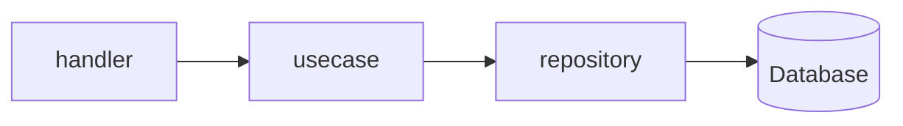
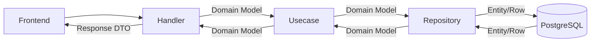

# Backend (Go)

漁港のせりシステムのバックエンドAPIサーバーです。

## 技術構成 (Tech Stack)

- **Language**: Go 1.26+
- **Database**: PostgreSQL
- **Cache**: Redis
- **Framework/Libraries**:
  - `net/http` & [gorilla/mux](https://github.com/gorilla/mux) (Router)
  - [Air](https://github.com/cosmtrek/air) (Live Reload)
  - `database/sql` (Standard Library for DB access)
  - `lib/pq` (PostgreSQL Driver)
  - 内蔵マイグレーションシステム (SQL埋め込み・自動適用)

## アーキテクチャ (Architecture)

保守性と拡張性を高めるために、関心の分離を意識した **クリーンアーキテクチャ** を採用しています。



### データフロー (Data Flow)

ドメインモデル（`internal/domain`）をアプリケーションの中心に据え、外部との境界で適切に変換を行うことで、ビジネスロジックの純粋性を保っています。



### レイヤー構造とディレクトリ

```text
backend/
├── cmd/                # エントリポイント
│   └── server/         # API サーバーの起動設定
├── internal/
│   ├── domain/         # ドメイン層 (Entities, Interfaces)
│   ├── usecase/        # ユースケース層 (Business Logic)
│   ├── server/         # プレゼンテーション層 (Handlers, Routing)
│   │   └── handler/    # HTTP ハンドラー
│   └── infrastructure/ # インフラ層 (Persistence, External)
│       └── datastore/  # DB 永続化の実装 (PostgreSQL)
└── migrations/         # DB マイグレーション
```

## 開発環境 (Development)

バックエンドのみを個別に操作する場合の主なコマンドです。

### 前提条件

- **Go** (v1.26+)
- **PostgreSQL**, **Redis** が起動していること
  - ※ データベース等のインフラのみを Docker で起動する場合は `docker-compose up db redis` を実行してください。

### 1. サーバーの起動 (with Air)

```bash
cd backend
air
```

### 2. データベースマイグレーション

マイグレーションファイルは `migrations/` ディレクトリにあります。
サーバー起動時に `internal/registry/repository_registry.go` を通じて自動的に適用されます。
