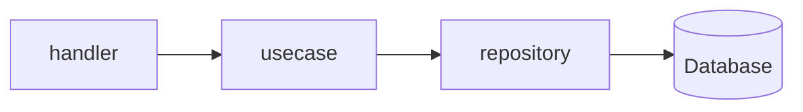

# Backend (Go)

漁港のせりシステムのバックエンドAPIサーバーです。

## 技術構成 (Tech Stack)

- **Language**: Go
- **Database**: PostgreSQL (GORM)
- **Framework/Libraries**:
  - [Echo](https://echo.labstack.com/) (Web Framework)
  - [Air](https://github.com/cosmtrek/air) (Live Reload)
  - 内蔵マイグレーションシステム (自動検知・実行)

## アーキテクチャ (Architecture)

保守性と拡張性を高めるために、関心の分離を意識した **クリーンアーキテクチャ** を採用しています。



### レイヤー構造とディレクトリ

- **cmd/server**: エントリポイント。サーバーの起動設定。
- **internal/domain**: ビジネスエンティティとリポジトリのインターフェース定義（外部非依存）。
- **internal/usecase**: アプリケーション固有のビジネスロジック。
- **internal/server/handler**: HTTPハンドラー。リクエストバリデーション、レスポンス成形。
- **internal/infrastructure**: インフラ層の実装（DB永続化、外部サービス）。
- **migrations**: データベースマイグレーションファイル。

```
backend/
├── cmd/               # エントリポイント
├── internal/
│   ├── domain/        # ドメイン層 (Entities, Interfaces)
│   ├── usecase/       # ユースケース層 (Business Logic)
│   ├── server/        # プレゼンテーション層 (Handlers)
│   └── infrastructure/# インフラ層 (Persistence, External)
└── migrations/        # DBマイグレーション
```

## 開発環境 (Development)

バックエンドのみを個別に操作する場合の主なコマンドです。

### サーバーの起動 (with Air)

```bash
cd backend
air
```

### データベースマイグレーション

マイグレーションファイルは `migrations/` ディレクトリにあります。
Docker Compose 起動時に自動的に適用されます。
