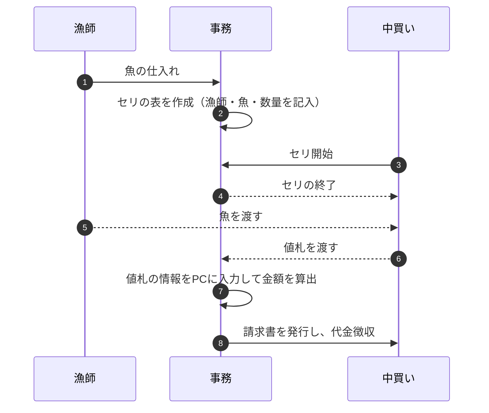
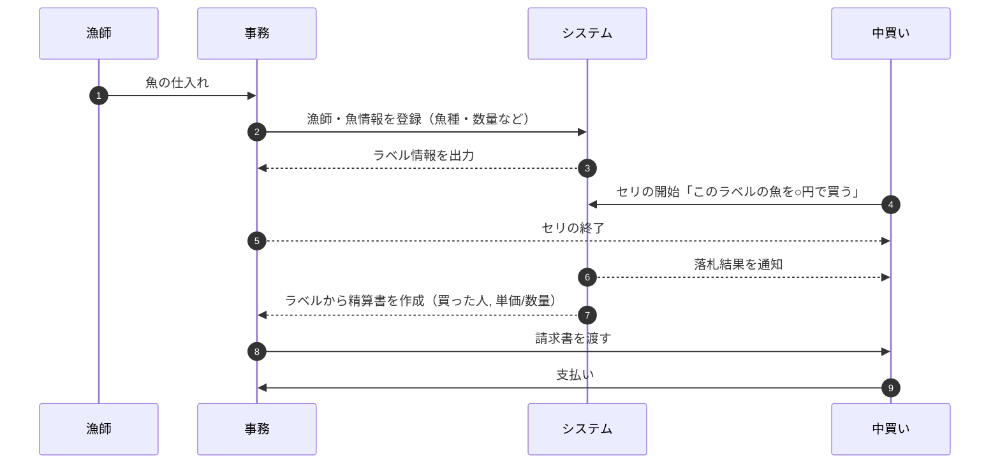

## 要件定義

登場人物:
-  漁師
-  中買い人
-  漁港の事務

現在の業務のフロー:
1. 漁師: 漁師が魚を用意する
2. 事務: 漁師と魚をセットにして表を作成する
3. 中買: 魚を見て、セリを行う
	a. 魚に値札をつける
	b. 1匹ずつ飼うときもあれば、重量でまとめ買いすることもある
4. 中買:  漁師に魚を渡す
5. 事務: 中買いのひとがつけた値札を持って帰る
6. 事務: 持って帰った値札を PC に入力する
	a. 事務の人は、値段を間違えないように録音しておき、確認しながら入力する
7. 事務: 請求書を作る
	a. 手数料を計算する (消費税売上の 8%を上乗せ、組合分の5%の値段を引いたものが請求額)
	b. 中買の人が事務所にくるので、お金を徴収する

課題:
- 5, 6, 7 が少し手間に感じている
- これをセリが終わった直後に、セリの会場で出すことができればいいのでは？という話

### ASIS

---
### TOBE

