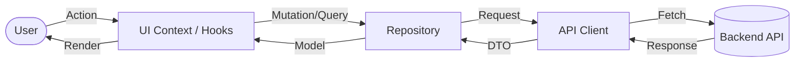

# Frontend (Next.js)

漁港のせりシステムのフロントエンドアプリケーションです。

## 技術構成 (Tech Stack)

- **Framework**: Next.js 16 (App Router)
- **Language**: TypeScript
- **Styling**: Vanilla CSS, [Panda CSS](https://panda-css.com/) (Design Tokens)
- **State Management**: [TanStack Query](https://tanstack.com/query/latest) (React Query)
- **Testing**: Vitest / React Testing Library
- **Authentication**: クッキーベースの認証

### コンポーネント設計 (Atomic Design)

- **Atoms**: 最小単位のボタン、入力フォーム、アイコンなどの汎用パーツ。
- **Molecules**: Atoms を組み合わせた、特定の役割を持つ塊（ステータスラベル、入力フィールド）。
- **Organisms**: ドメイン知識を伴う、より具体的で機能的なコンポーネント（入札ダイアログ、アイテムカード）。
- **Templates**: ページ全体のレイアウト構造を定義する枠組み。

### データフロー (Data Flow)



### ディレクトリ構成

```text
frontend/
├── app/               # Next.js App Router (Pages, Templates, Organisms)
│   ├── auctions/      # オークション関連ページ
│   ├── items/         # アイテム管理ページ
│   └── _components/   # ページ共有の構成要素 (Organisms, Templates)
├── src/
│   └── core/          # 基盤機能
│       ├── ui/        # 汎用UIコンポーネント (Atoms, Molecules)
│       ├── repository/# TanStack Query によるサーバー状態管理
│       └── api/       # API クライアント
├── hooks/             # UI ロジックを抽象化するカスタムフック
└── public/            # 静的アセット
```

## 開発環境 (Development)

フロントエンドのみを個別に操作する場合の主なコマンドです。

### 前提条件

- **Node.js** (v20+)
- **Yarn**

### 1. 依存関係のインストール

```bash
cd frontend
yarn install
```

### 2. 開発サーバーの起動

```bash
yarn dev
```

ブラウザで `https://localhost` (Nginx 経由) または `http://localhost:3000` (直通) を開いてください。

### 3. テストの実行

```bash
yarn test
```
