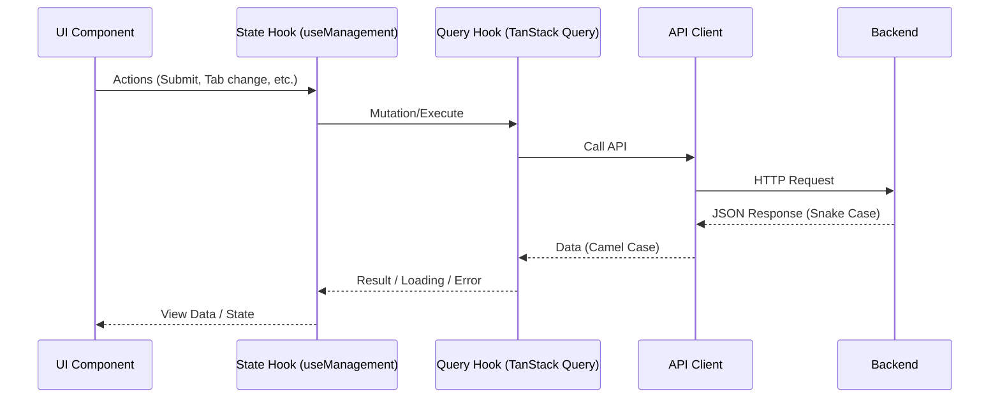

# Frontend Architecture

本ドキュメントでは、フロントエンドアプリケーションの設計思想と実装パターンについて詳述します。

## 設計思想

1.  **関心の分離 (Separation of Concerns)**:
    - UI（表示）、State（外部接続・状態管理）、Data（通信基盤）を明確に分離します。
2.  **カプセル化 (Encapsulation)**:
    - 機能ごとに「Feature」としてカプセル化し、他機能への依存を最小限に抑えます。
3.  **宣言的データフェッチ (Declarative Data Fetching)**:
    - `TanStack Query` を活用し、データの取得・キャッシュ・同期を宣言的に記述します。

## レイヤー構造

### 1. Presentation Layer (`src/components`, `src/features/*/components`)
- **Atomic Design** をベースにしたコンポーネント構成。
- 共有パーツは `src/components`、機能特有のパーツは `src/features/*/components` に配置します。
- `Atoms` / `Molecules` はドメイン知識を持たない純粋な UI 担い、`Organisms` 以上でドメイン知識を注入します。

### 2. Logic Layer (`src/features/*/states`)
- feature に応じたカスタムフックを配置します。実コードでは `useLogin` のような軽量な命名も使われています。
- 以下の役割を持ちます：
  - `react-hook-form` によるフォーム状態の管理。
  - `TanStack Query` のフック呼び出し。
  - 複数のデータソースの組み合わせや、エラー/成功時の UI フィードバック（Toast 等）の制御。

### 3. Data Access Layer (`src/data`, `src/features/*/queries`)
- **Queries**: `TanStack Query` の `useQuery` / `useMutation` をラップしたフック。Query Keys の管理もここで行います。
- **Entities**: サーバー側のデータ構造の真実の源泉（`backend/internal/infrastructure/entity` 等から生成）。`@entities/*` 経由で取得します。

### 4. Logic Layer (`src/features/*/types`)
- **Feature-specific Types**: 各 Feature が必要とする最小限のドメインモデルおよび UI 専用の型を定義します。
- **原則**: 他の Feature や `@entities` から型をインポートせず、Feature 内で完結させます。これにより、サーバー側の変更や他機能の変更からロジックを保護（疎結合化）します。
- **データ変換**: `features/*/queries` 層において、`@entities` から Feature ローカルの型への変換（またはキャスト）を行います。

### 5. Infrastructure Layer (`src/core`)
- **API Client**: `fetch` API のラッパー。インターセプターや共通のエラーハンドリング、ケース変換（Snake <-> Camel）を実装します。

## データフロー詳細

## 命名規則

- **Hooks**: `use` プレフィックス。
- **Forms**: `XXXFormData` (Type), `XXXSchema` (Zod).
- **Queries**: `useXXXQuery`, `useXXXMutation`.
- **Query Keys**: `xxxKeys` オブジェクトにより一元管理。

## コーディング規約

- **TypeScript Standard**: Strict モード。全ての API レスポンスに型を定義します。
- **Styling**: Panda CSS の `css()` 関数または `styled` 抽象化を使用。インラインスタイルは避けます。
- **Security**: ユーザー入力のサニタイズ（Zod）、CSRF 保護の考慮（apiClient）。
